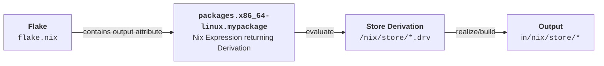

<!-- markdownlint-disable-file MD034 MD033 MD001 MD024 MD026-->

# Introduction

## Why Nix

We will see in a minute!

---

## Requirements

All examples refer to the
[workshop repository](https://github.com/sdsc-ordes/nix-workshop/blob/main/examples/what-is-my-ip-orig.nix)
in the root directory.

Ensure that you have installed
[`Nix`](https://swissdatasciencecenter.github.io/best-practice-documentation/docs/dev-enablement/nix-and-nixos#installing-nix)
and
[`direnv`](https://swissdatasciencecenter.github.io/best-practice-documentation/docs/dev-enablement/nix-and-nixos#installing-direnv).

The basic requirements for working with this repository are:

- `just`
- `nix`

See
[instructions](https://swissdatasciencecenter.github.io/best-practice-documentation/docs/dev-enablement/nix-and-nixos).

🪟 Windows Users: kindly asked to leave this presentation (since Nix is for Unix
system) **or** use **WSL Ubuntu**.

---

## What is Nix

:::incremental

- A _domain-specific_ **functional** language (**no side-effects**).

- Structurally similar to JSON but with
  [_functions_](https://nixos.org/guides/nix-pills/05-functions-and-imports.html).

- Supports fundamental data types such as `string`, `integer`, `path`, `list`,
  and `attribute set`. See
  [Nix Language Basics](https://nixos.org/guides/nix-pills/04-basics-of-language.html#basics-of-language).

- **Lazy evaluated**, _expression evaluation delayed until needed_.

- ⚠️The Nix language is **specifically designed** for
  **deterministic/reproducible** software deployment.

:::

:::notes

The Nix language is specifically designed for deterministic software building
and distribution. Due to its narrow scope, it lacks certain features, such as
floating-point types, which are unnecessary in this context.

:::

---

## Nix Language

::: incremental

- Nix files have suffix `.nix` and contain mostly 1
  [_function_](https://nixos.org/guides/nix-pills/05-functions-and-imports.html).

- The function `args: ...` in file `myfunction.nix` takes one argument `args`
  and

  ```nix {line-numbers="2|3|4|5|6|7|8|9"}
  # myfunction.nix
  args:
  let
    aNumber = 1;  # A number.
    aList = [ 1 2 3 "help"];  # A list with 4 elements.
    anAttrSet = { a = 1; b.c.d = [1]; };  # A nested attribute set.
    result = args.myFunc { val1 = aNumber; };  # Calls another function `args.myFunc`.
  in
  { val1 = aNumber; val2 = anAttrSet.b.c.d; val3 = result; }
  ```

  returns an attribute set `{ val1 = ... }`.

- Watch this [short introduction](https://www.youtube.com/watch?v=HiTgbsFlPzs)
  for the basic building block.

:::

---

## Examples

Verify the next examples in the Nix Repl (Return-Eval-Prompt-Loop):

```bash
nix repl
```

or pass std. input to `nix eval`:

```bash
echo '
  let a = 3; in a
' | nix eval --file -
```

**In
[workshop repository](https://github.com/sdsc-ordes/nix-workshop/blob/main/examples/what-is-my-ip-orig.nix)**:

```bash
echo '3' | just eval
```

---

## Examples

::::::{.columns}

:::{.column width="50%"}

```nix {line-numbers="2|3|5|6" .fragment}
let # start for "procedural" statements
 mult = a: b: a * b;
 x10 = mult 10; # Bind the first arg.
in
x10 (mult 8 2)
# -> 160
```

```nix {line-numbers="2|2-4|7|8" .fragment}
let
f = args: {
  a = args.banana + "-nice";
  b = args.orange + "-sour";
};
in
f { banana = "1"; orange = "2" }
# -> { a = "1-nice"; b = "2-sour"; }
```

:::

:::{.column width="50%"}

```nix {line-numbers="2|2-4|7|8" .fragment}
let
f = { ban, ora, ...}: { # Destructuring
  a = ban + "-nice";
  b = ora + "-sour";
};
in
f { ban = "1"; ora = "2"; berry ="3"; }
# -> { a = "1-nice"; b = "2-sour"; }
```

```nix {line-numbers="2|3|5|6" .fragment}
let
f = list: {
  a = builtins.map (x: x*x) list;
};
in f [ 1 3 9 ]
# -> [ 1 9 81 ]
```

:::

::::::

---

### More Examples

::::::{.columns}

:::{.column width="50%"}

```nix {line-numbers="2|3" .fragment}
# Concat lists.
[ 1 2 3 ] ++ [ 1 2 3 ]
# [ 1 2 3 1 2 3 ];
```

```nix {line-numbers="2|3" .fragment}
# Merge attribute sets.
{ a = 1; b = 2; } // { a = 2; c = 3; }
# -> { a = 2; b = 2; c = 3; }
```

```nix {line-numbers="1-5|2|3|4|6" .fragment}
rec {
  b = 2;
  c = b + d:
  d = 10;
}
# -> { b = 2; c = 12; d = 10; }
```

:::

:::{.column width="50%"}

```nix {line-numbers="3|5|6" .fragment}
# Lazy evaluation.
let
  x = abort "fail";
in
if false then x else 42
# -> 42
```

```nix {line-numbers="3|4" .fragment}
# Import files.
let
  myfunc = import ./myfunction.nix;
in myfunc 1 + (import ./other.nix 3)
```

:::

::::::

---

## Attribute Set Building: `inherit`

```nix {line-numbers="3|4|5|8|9" .fragment}
# Inherit 'key = value'.
let
  width = 100;
  color = "blue";
  set = { b = 1; };
in
{
  inherit color;   # color = color;
  inherit (set) b; # b     = set.b;
}
```

---

## Variable Interpolation

```nix {line-numbers="2|3|4-6|7" .fragment}
let
  key = "c"
  color = "blue";
  set = {
    c = { v = "hello-${color}" ;}
  };
in set.${key}.v

# -> "hello-blue"
```

---

## Strings and Paths

```nix
let
  file = ./.github/workflows;    # A path. Nix makes them absolute!
  drv = "${file}/gh-pages.yaml"; # Interpolated path gets added into the `/nix/store`.
in drv
# -> "/nix/store/w9il9gvki2nfdzfc1lrlbiv3xy3mx90a-workflows/gh-pages.yaml"
```

---

## Caution With `let` Statements

Do not reassign in `let` blocks:

```nix {line-numbers="2|3|3,6"}
let
  a = "hello";
  a = a + "world";
  #   ^
  #   |
  #  🆘 Endless recursion, this is not reassigning.
in a
```

:::{.fragment}

✅ Configure [ `nixd` ](https://github.com/nix-community/nixd) (Nix Language
Server) in your IDE to see "Go to definitions".

:::

## Fixed Point Combinator 🤯

In maths a fix point `x` of a function `f` is defined as:

$$
x = f(x).
$$

:::{.fragment}

In functional programming a fix-point **combinator** `fix` is a _higher-order_
function.<br> It returns the fix point of a function `g`:

:::

:::{.fragment}

```nix
 fix = g: g (fix g)
```

:::

:::{.fragment}

Really?

Apply `fix` to a function `f` and see what it returns:

$$
\underbrace{\text{fix}(f)}_{x} = f( \underbrace{\text{fix}(f)}_{x} )
$$

:::

---

## Fixed-Point Combinator 🤯

That is how recursive self-referential sets can be defined.

```nix {line-numbers="2|5|7|9"}
let
  fix = g: g (fix g); # Fix-point combinator.

  # Define the constructor.
  newSet = self: { path = "/bin"; full = self.path + "/my-app"; };

  mySet = fix newEnv;               # fulfills: myEnv == fix myEnv;
in
  mySet.full
```

Seems recursive: `fix` calls `fix` again **but isn't 🤯**, because its lazy
evaluated. More explanations here.

Used in `pkgs.callPackage` in `nixpkgs`.

---

## Learn Nix the Fun Way

### [Learn Nix the Fun Way](https://fzakaria.github.io/learn-nix-the-fun-way)

---

# Workshop

## Building Our First Package (1) {#building-package}

Put the following in a script
[`whats-is-my-ip.nix`](https://github.com/sdsc-ordes/nix-workshop/blob/main/examples/what-is-my-ip.nix):

```nix {line-numbers="2|3|4-7"}
{
system ? builtins.currentSystem, # Mostly: x86_64-linux
pkgs ?
  import (builtins.fetchTarball
    "https://github.com/NixOS/nixpkgs/archive/9684b53175fc6c09581e94cc85f05ab77464c7e3.tar.gz") {
    inherit system;
  },
}:
pkgs.writeShellScriptBin "what-is-my-ip" ''
  ${pkgs.curl}/bin/curl -s http://httpbin.org/get | \
    ${pkgs.jq}/bin/jq --raw-output .origin
''
```

::: {.fragment .quiz}

_**Quiz:** What returns `builtins.fetchTarball "..."`?_

:::

:::notes

This function takes two parameters:

- `system`: a string mostly `x86_64-linux` and defaulted to your current system)
  and
- `pkgs`: an attribute set and defaulted to the main function of the `nixpkgs`
  repository. The repository `nixpkgs` is the central package mono-repository
  which maintains packages (_derivations_) for Nix.

:::

---

## Building Our First Package (2)

```bash
nix build -f ./examples/what-is-my-ip.nix --print-out-paths

> "/nix/store/7x9hf9g95d4wjjvq853x25jhakki63bz-what-is-my-ip"
```

::: {.fragment}

Explore whats in this file
`/nix/store/7x9hf9g95d4wjjvq853x25jhakki63bz-what-is-my-ip/bin/what-is-my-ip`:

```bash
#!/nix/store/mc4485g4apaqzjx59dsmqscls1zc3p2w-bash-5.2p37/bin/bash
/nix/store/zl7h70n70g5m57iw5pa8gqkxz6y0zfcf-curl-8.12.1-bin/bin/curl \
  -s "http://httpbin.org/get" | \
  /nix/store/y50rkdixqzgdgnps2vrc8g0f0kyvpb9w-jq-1.7.1-bin/bin/jq \
    --raw-output ".origin"
```

Nix has encoded the executables used by **store paths** (`/nix/store`).

:::

:::{.fragment .quiz}

_**Quiz:** Can you share this script with your colleague?_

:::

:::notes

Do not think you can now simply share this script by giving the contents of
directory `/nix/store/7x9hf9g95d4wjjvq853x25jhakki63bz-what-is-my-ip` to
somebody else and it will work. This is not sufficient as we need the other
derivations as well. This is done differently namely over Nix itself, because
Nix has all information (`nix copy`).

:::

## Building Our First Package (3)

```nix
pkgs.writeShellScriptBin "what-is-my-ip" ''
  ${pkgs.curl}/bin/curl -s http://httpbin.org/get | \
    ${pkgs.jq}/bin/jq --raw-output .origin
''
```

The `pkgs.writeShellScriptBin` is a **trivial builder** function around the
fundamental `derivation` command (see
[./examples/what-is-my-ip-orig.nix](https://github.com/sdsc-ordes/nix-workshop/blob/main/examples/what-is-my-ip-orig.nix)):

---

```nix {line-numbers="1|2|4|5|7-20|22,10"}
derivation {
  inherit system;

  name = "what-is-my-ip";
  builder = "/bin/sh";

  args = [
    "-c"
    ''
      ${pkgs.coreutils}/bin/mkdir -p $out/bin

      {
        echo '#!/bin/sh'
        echo '${pkgs.curl}/bin/curl -s http://httpbin.org/get | \
        ${pkgs.jq}/bin/jq --raw-output .origin'
      } > $out/bin/what-is-my-ip

      ${pkgs.coreutils}/bin/chmod +x $out/bin/what-is-my-ip
    ''
  ];

  outputs = [ "out" ];
}
```

---

## Inspect the Dependency Graph

Run

```bash
nix run github:craigmbooth/nix-visualize -- \
  -c tools/configs/nix-visualize/config.ini
  -s nix
  "$(nix build -f ./examples/what-is-my-ip.nix --print-out-paths)"
```

and inspect `frame.png`.

::: {.center-content .p-no-margin}

{width="50%"
.border-light }

:::

---

## Inspect the Dependency Graph (2)

:::{.quiz}

_**Quiz:** What do you expect
`/nix/store/zl7h70n70g5m57iw5pa8gqkxz6y0zfcf-curl-8.12.1-bin/bin/curl` links to
and what does your system `curl` link to on e.g. Ubuntu/macOS? Use `ldd curl` to
inspect._

:::

:::notes

Nix builds in a sandbox where only `/nix/store` (and some others, +no internet)
is available. Any build tool which is used during the build of a Nix derivation
will typically only pick up these libraries from the `/nix/store` (any linker
will link to these files). For `pkgs.writeShellScriptBin` it will also analyze
the output script for store paths and include these in the runtime dependencies.

:::

---

## Nix Terminology

## What Is a Flake?

You have seen files like `flake.nix` lying around in repositories already.

A [`flake.nix`](./flake.nix) provides

:::incremental

- a **deterministic** way to manage dependencies and configurations in Nix
  [(Slide of the Nix Founder)](https://www.youtube.com/live/yhfDtRRTmY8?si=xTjOKKIWIZPIwoU3&t=18317).

- comes with a `flake.lock` file which locks dependencies.

:::

:::{.fragment}

[Remember `fetchTarball "..."` in `what-is-my-ip.nix`](#building-package) which
locks `pkgs` to a certain commit on the `nixpkgs` repository, a flake is a
better way to manage locked inputs.

:::

## What Is a Flake (2)

A flake

::::::{.columns}

:::{.column width="50%"}

:::incremental

- references external Nix functions - called
  [**inputs**](https://nixos-and-flakes.thiscute.world/nixos-with-flakes/nixos-flake-configuration-explained#_1-flake-inputs).

  - Other repositories, local files, or URLs with a `flake.nix`.

- defines structured
  [**outputs**](https://nixos-and-flakes.thiscute.world/nixos-with-flakes/nixos-flake-configuration-explained#_2-flake-outputs)
  (a function)

  - Specifies what the flake provides.

:::

:::

:::{.column width="50%"}

```nix
{
  inputs = { /* ... */ };

  outputs = inputs: {
    packages = /* implementation */

    # ... other output attributes ...
  }
}
```

:::

::::::

:::notes

- **Inputs**: An attribute set `inputs`, listing dependencies the flake relies
  on.
- **Outputs**: A function that takes all `inputs` and returns an
  [](https://nixos-and-flakes.thiscute.world/other-usage-of-flakes/outputs),
  specifying what the flake provides (e.g., packages, modules, or NixOS
  configurations).

:::

---

## What Is A Flake? (3)

:::incremental

- Nix can evaluate a `flake.nix` by calling the `outputs` function passing all
  `inputs`.

  - Try `nix repl .` to load all outputs in `./flake.nix` is at the root (`.`).

  - Check `outputs.packages.x86_64-linux = { ... }`. It is a flat attribute set
    of Nix **derivations**.

:::

:::notes

Another method is to start the `nix repl` and then type `:lf .` which is almost
the same except that the available attributes are now `inputs` and `outputs`:

:::

---

## What Is a Nix Derivation?

A [derivation](https://nix.dev/manual/nix/2.24/glossary#gloss-derivation) is a

- **specialized attribute set** that describes how to build a Nix package.

  ```nix
  { type = "derivation"; ... }
  ```

  Check `nix repl -f <nixpkgs>` and type `pkgs.curl.type`.

::: notes

A [derivation](https://nix.dev/manual/nix/2.24/glossary#gloss-derivation) is a
**specialized attribute set** that describes how to build a Nix package. In raw
form, it looks like `{ type = "derivation"; ... }` and carries a well-defined
structure with built-in meaning.

:::

---

## Derivation Definition

> A **derivation** is an instruction that Nix uses to realize a package. Created
> using a special `derivation` function in the Nix language, it can depend on
> multiple other derivations and produce one or more outputs. The complete set
> of dependencies required to build a derivation—including its transitive
> dependencies—is called a **closure**.
> [[Ref]](https://zero-to-nix.com/concepts/derivations)

## Evaluating a Derivation

When Nix evaluates a derivation, it stores the result in the Nix store
(`/nix/store`) as a **store derivation**
([more details](https://nix.dev/manual/nix/2.24/glossary#gloss-store-derivation)).



---

## Inspect a Derivation

```bash
nix eval ".#packages.x86_64-linux.my-tool"

> «derivation /nix/store/72zknv2ssr8pkvf5jrc0g5w64bqjvyq1-treefmt.drv»
```

`.#packages.x86_64-linux.my-tool` is an _installable_. More later!

:::{.fragment}

```bash
# Inspect the store derivation.
cat /nix/store/72zknv2ssr8pkvf5jrc0g5w64bqjvyq1-treefmt.drv
```

:::

:::notes

Realize that even when you are on macOS `aarch64-darwin`, that we can evaluate
the derivation for another architecture.

:::

---

## Inspect a Derivation (2)

```bash
> Derive([("out","/nix/store/5rvqlxk2vx0hx1yk8qdll2l8l62pfn8n-treefmt","","")],
[("/nix/store/1fmb3b4cmr1bl1v6vgr8plw15rqw5jhf-treefmt.toml.drv",["out"]),
("/nix/store/3avbfsh9rjq8psqbbplv2da6dr679cib-treefmt-2.1.0.drv",["out"]),
("/nix/store/61fjldjpjn6n8b037xkvvrgjv4q8myhl-bash-5.2p37.drv",["out"]),
("/nix/store/gp6gh2jn0x7y7shdvvwxlza4r5bmh211-stdenv-linux.drv",["out"])]
,["/nix/store/v6x3cs394jgqfbi0a42pam708flxaphh-default-builder.sh"]
,"x86_64-linux","/nix/store/8vpg72ik2kgxfj05lc56hkqrdrfl8xi9-bash-5.2p37/bin/bash",
["-e","/nix/store/v6x3cs394jgqfbi0a42pam708flxaphh-default-builder.sh"],
[ ("__structuredAttrs",""),("allowSubstitutes",""),
("buildCommand","target=$out/bin/treefmt\nmkdir -p \"$(dirname \"$target\")\"\n\nif [ -e \"$textPath\" ]; then\n  mv \"$textPath\" \"$target\"\nelse\n  echo -n \"$text\" > \"$target\"\nfi\n\nif [ -n \"$executable\" ]; then\n  chmod +x \"$target\"\nfi\n\neval \"$checkPhase\"\n"),("buildInputs",""),("builder","/nix/store/8vpg72ik2kgxfj05lc56hkqrdrfl8xi9-bash-5.2p37/bin/bash"),("checkPhase","/nix/store/8vpg72ik2kgxfj05lc56hkqrdrfl8xi9-bash-5.2p37/bin/bash -n -O extglob \"$target\"\n"),("cmakeFlags",""),("configureFlags",""),("depsBuildBuild",""),("depsBuildBuildPropagated",""),("depsBuildTarget",""),("depsBuildTargetPropagated",""),("depsHostHost",""),("depsHostHostPropagated",""),("depsTargetTarget",""),("depsTargetTargetPropagated",""),("doCheck",""),("doInstallCheck",""),("enableParallelBuilding","1"),("enableParallelChecking","1"),("enableParallelInstalling","1"),("executable","1"),("mesonFlags",""),("name","treefmt"),("nativeBuildInputs",""),("out","/nix/store/5rvqlxk2vx0hx1yk8qdll2l8l62pfn8n-treefmt"),("outputs","out"),("passAsFile","buildCommand text"),("patches",""),("preferLocalBuild","1"),("propagatedBuildInputs",""),("propagatedNativeBuildInputs",""),("stdenv","/nix/store/hsxp8g7zdr6wxk1mp812g8nbzvajzn4w-stdenv-linux"),("strictDeps",""),("system","x86_64-linux"),("text","#!/nix/store/8vpg72ik2kgxfj05lc56hkqrdrfl8xi9-bash-5.2p37/bin/bash\nset -euo pipefail\nunset PRJ_ROOT\nexec /nix/store/0jcp33pgf85arjv3nbghws34mrmy7qq5-treefmt-2.1.0/bin/treefmt \\\n  --config-file=/nix/store/qk8rqccch6slk037dhnprryqwi8mv0xs-treefmt.toml \\\n  --tree-root-file=.git/config \\\n  \"$@\"\n\n")])
```

:::{.fragment}

JSON output of the above:

```bash
nix derivation show /nix/store/72zknv2ssr8pkvf5jrc0g5w64bqjvyq1-treefmt.drv
```

:::

:::notes

The output of `/nix/store/72zknv2ssr8pkvf5jrc0g5w64bqjvyq1-treefmt.drv` above is
the internal serialization of the formatter's derivation which **when built**
can be used to format all files in this repository.

:::

---

## Inspect a Derivation ()

```json {style="max-height:100px;"}
{
  "/nix/store/72zknv2ssr8pkvf5jrc0g5w64bqjvyq1-treefmt.drv": {
    "args": [
      "-e",
      "/nix/store/v6x3cs394jgqfbi0a42pam708flxaphh-default-builder.sh"
    ],
    "builder": "/nix/store/8vpg72ik2kgxfj05lc56hkqrdrfl8xi9-bash-5.2p37/bin/bash",
    "env": {
      "__structuredAttrs": "",
      "allowSubstitutes": "",
      "buildCommand": "target=$out/bin/treefmt\nmkdir -p \"$(dirname \"$target\")\"\n\nif [ -e \"$textPath\" ]; then\n  mv \"$textPath\" \"$target\"\nelse\n  echo -n \"$text\" > \"$target\"\nfi\n\nif [ -n \"$executable\" ]; then\n  chmod +x \"$target\"\nfi\n\neval \"$checkPhase\"\n",
      "buildInputs": "",
      "builder": "/nix/store/8vpg72ik2kgxfj05lc56hkqrdrfl8xi9-bash-5.2p37/bin/bash",
      "checkPhase": "/nix/store/8vpg72ik2kgxfj05lc56hkqrdrfl8xi9-bash-5.2p37/bin/bash -n -O extglob \"$target\"\n",
      "cmakeFlags": "",
      "configureFlags": "",
      "depsBuildBuild": "",
      "depsBuildBuildPropagated": "",
      "depsBuildTarget": "",
      "depsBuildTargetPropagated": "",
      "depsHostHost": "",
      "depsHostHostPropagated": "",
      "depsTargetTarget": "",
      "depsTargetTargetPropagated": "",
      "doCheck": "",
      "doInstallCheck": "",
      "enableParallelBuilding": "1",
      "enableParallelChecking": "1",
      "enableParallelInstalling": "1",
      "executable": "1",
      "mesonFlags": "",
      "name": "treefmt",
      "nativeBuildInputs": "",
      "out": "/nix/store/5rvqlxk2vx0hx1yk8qdll2l8l62pfn8n-treefmt",
      "outputs": "out",
      "passAsFile": "buildCommand text",
      "patches": "",
      "preferLocalBuild": "1",
      "propagatedBuildInputs": "",
      "propagatedNativeBuildInputs": "",
      "stdenv": "/nix/store/hsxp8g7zdr6wxk1mp812g8nbzvajzn4w-stdenv-linux",
      "strictDeps": "",
      "system": "x86_64-linux",
      "text": "#!/nix/store/8vpg72ik2kgxfj05lc56hkqrdrfl8xi9-bash-5.2p37/bin/bash\nset -euo pipefail\nunset PRJ_ROOT\nexec /nix/store/0jcp33pgf85arjv3nbghws34mrmy7qq5-treefmt-2.1.0/bin/treefmt \\\n  --config-file=/nix/store/qk8rqccch6slk037dhnprryqwi8mv0xs-treefmt.toml \\\n  --tree-root-file=.git/config \\\n  \"$@\"\n\n"
    },
    "inputDrvs": {
      "/nix/store/1fmb3b4cmr1bl1v6vgr8plw15rqw5jhf-treefmt.toml.drv": {
        "dynamicOutputs": {},
        "outputs": ["out"]
      },
      "/nix/store/3avbfsh9rjq8psqbbplv2da6dr679cib-treefmt-2.1.0.drv": {
        "dynamicOutputs": {},
        "outputs": ["out"]
      },
      "/nix/store/61fjldjpjn6n8b037xkvvrgjv4q8myhl-bash-5.2p37.drv": {
        "dynamicOutputs": {},
        "outputs": ["out"]
      },
      "/nix/store/gp6gh2jn0x7y7shdvvwxlza4r5bmh211-stdenv-linux.drv": {
        "dynamicOutputs": {},
        "outputs": ["out"]
      }
    },
    "inputSrcs": [
      "/nix/store/v6x3cs394jgqfbi0a42pam708flxaphh-default-builder.sh"
    ],
    "name": "treefmt",
    "outputs": {
      "out": {
        "path": "/nix/store/5rvqlxk2vx0hx1yk8qdll2l8l62pfn8n-treefmt"
      }
    },
    "system": "x86_64-linux"
  }
}
```

---

## Store Derivation - What is that good for?

> A **derivation** contains only **build instructions** for Nix to
> **realize/build** it. This can be literally anything, e.g. a software package,
> a wrapper shell script or only source files.

## Build A Derivation

:::{.fragment}

We can build the above derivation - or in other terms **realize it in the Nix
store** - by doing:

```bash
nix build /nix/store/72zknv2ssr8pkvf5jrc0g5w64bqjvyq1-treefmt.drv
```

:::

:::{.fragment}

or directly

```bash
nix build ".#packages.x86_64-linux.my-tool" --out-link ./my-tool
```

:::

:::{.fragment}

✅: **Use Short Form**: `nix build .#my-tool` which uses
`builtins.currentSystem` (works also for macOS users).

:::

::::::{.columns}

:::{.column width="50%" .fragment}

✅ Inspect `tree ./my-tool`:

```bash
/nix/store/5rvqlxk2vx0hx1yk8qdll2l8l62pfn8n-treefmt
└── bin
    └── my-tool
```

:::

:::{.column width="50%" .fragment}

✅ Run it with:

```bash
./my-tool/bin/my-tool -h
```

```bash
nix run ".#packages.x86_64-linux.my-tool"
```

:::

:::

## What Is an Installable

:::{.fragment}

The path `.#packages.x86_64-linux.my-tool` is referred to as a
[Flake output attribute installable](https://nix.dev/manual/nix/2.24/command-ref/new-cli/nix#flake-output-attribute),
or simply an
[_installable_](https://nix.dev/manual/nix/2.24/command-ref/new-cli/nix#installables).

:::

:::{.fragment}

An **installable** is a Flake output that can be realized in the Nix store.

:::

::: incremental

- `.` refers to this repository’s [`flake.nix`](./flake.nix) directory.
- `packages.x86_64-linux.my-tool` following `#` is an output attribute defined
  within the flake.

:::

Most
[modern Nix commands](https://nix.dev/manual/nix/2.24/command-ref/experimental-commands)
accept **installables** as input, making them a fundamental concept in working
with Flakes. **You should only use the modern commands, e.g.
`nix <subcommand>`**. Stay away from the command `nix-env`.

## What Is a DevShell?

Its a Nix **derivation** in the output attribute set `devShells` of the
`flake.nix`:

```nix
{
  inputs = { /* ... */ };
  outputs = inputs: {
    packages = {
      my-tool = /* derivation */
    };

    devShells = {
      banana-shell = /* derivation */
    };

    # ... other output attributes ...
  }
}
```

The `banana-shell` derivation is meant to be consumed by `nix develop`.

## How to Create a DevShell Derivation?

The simple flake in
[`./examples/flake-simple`](https://github.com/sdsc-ordes/nix-workshop/blob/main/examples/flake-simple/flake.nix)
defines `devShells` an output:

```nix
devShells = forAllSystems (
  system:
  let
    pkgs = inputs.nixpkgs-unstable.legacyPackages.${system};
  in
  {
    default = pkgs.mkShell {
      packages = [
        pkgs.skopeo
        pkgs.cowsay
      ];

      shellHook = ''
        echo "Hello from Shell"
        ${pkgs.cowsay}/bin/cowsay
      '';
    };
  }
);
```

Function `pkgs.mkShell` makes a derivation consumable by `nix develop`:

```bash
nix develop "./examples/flake-simple#default"
```
