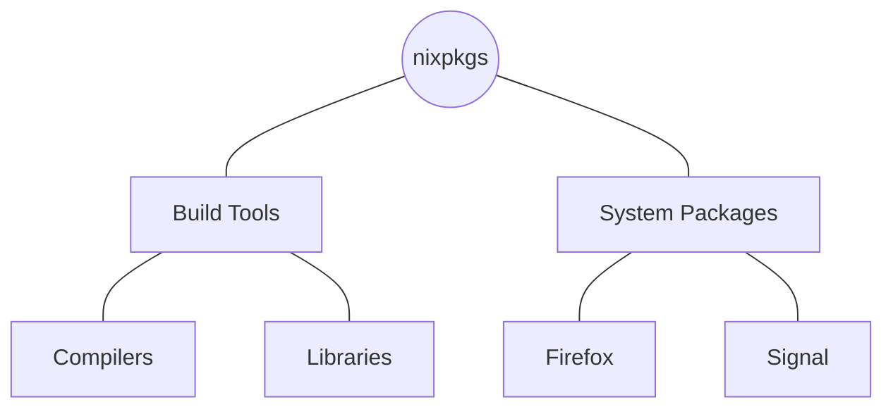
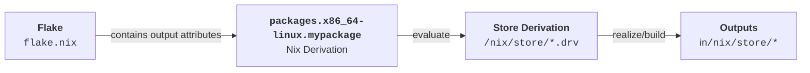

<!-- markdownlint-disable-file MD034 MD033 MD001 MD024 MD026-->

# Requirements

All examples refer to the
[workshop repository](https://github.com/sdsc-ordes/nix-workshop) in the root
directory.

Ensure that you
[have the requirements fulfilled](https://github.com/sdsc-ordes/nix-workshop#requirements).

# Motivation

##  Why Nix?

You start `python` and you get this:

```bash
>>> import numpy
Segmentation fault (core dumped)
```

:::notes

Importing a package like `numpy` in python is not a trivial task as you might
expect. `Numpy` heavily depends on build shared object files on your system,
such as `LAPACK`, `BLAS`, which it tries to load when you import `python`.

The error above is hard to identify, it might be due to misalignment of system
libraries with your python environment etc.

This will not happen with Nix, never!.

But you might ask, what is with `conda` or `devcontainers` or `mamba`? They
resolve these issues right?

:::

---

### 💣 It Works on My Machine

[{width="30%"}]{.center-content}

::: notes

Developer environments have become increasingly more complicated and the least
what we want is to be stuck in the land of `it works on my machine`.

Lets look at some technology which claim to setup reproducible developer
environments.

:::

---

### 🧪 Development Setups

<br>

:::{style=""}

| Feature          | Local Development | [Mamba](https://mamba.readthedocs.io) | [Devcontainer](https://containers.dev/implementors/spec/) | [Nix/DevShell](https://www.youtube.com/watch?v=yQwW8dkuHqw) |
| ---------------- | ----------------- | ------------------------------------- | --------------------------------------------------------- | ----------------------------------------------------------- |
| Maintainenance   | ⚠️ **High**       | ⚠️ Medium                             | ⚠️ Medium                                                 | ⚠️ Medium                                                   |
| Reproducibility  | ❌ Low            | ⚠️ Medium                             | ⚠️ Medium                                                 | ✅ **Very high**                                            |
| Ease of Use      | ❌ Low            | ✅ Easy                               | ✅ Ok                                                     | ❌ Low                                                      |
| Dep. Mgmt.       | ❌                | ✅                                    | ⚠️                                                        | ✅                                                          |
| Portability      | 💣                | ⚠️                                    | ✅                                                        | ✅                                                          |
| **CI Stability** | 💣                | ⚠️                                    | ⚠️                                                        | ✅ **Almost Perfect**                                       |

:::

[Full Table](https://swissdatasciencecenter.github.io/best-practice-documentation/docs/dev-enablement/dev-env)

:::notes

This table shows the comparison between different technologies for setting up
development environment. There exists many more of course. This chart is maybe
more for people using python setups.

The main I want to highlight here is that with a local development you obviously
dont get any benefit. You cannot reproduce anything and you are stuck in the
land of `it works on my machine`.

Also they are sometimes used together and mixed back and forth. So people might
use the `brew` package manager on macOS to install some stuff, then at the same
time use `mamba` or `conda` to install some better managed python environments,
and might interleave that with a `.devcontainer` etc. This is even more complex
and you can get rid of all this complexity once you have understood what Nix can
give you, which a lot of package managers try to solve but they don't or cannot
do it proper from the start.

:::

---

###  What is **Nix**?

**Nix** is a software package management & deployment infrastructure:

::: incremental

- 🏃🏻‍♂️Software is built and run in a **predictable and reproducible** way.

- ✅ Builds are **reproducible** — same inputs give same results.

- 🔄 Installs packages **without breaking** others.

- 📦 Can create **isolated dev environments**.

- 💻 Works on Linux, macOS.

:::

---

## Nix started 2006 ...

:::::::::{.columns}

:::{.column width="50%" }

](${meta:include-base-dir}/assets/images/phd-thesis.png){.border-light
width="70%"}

:::

:::{.column width="50%" .fragment}

{.border-light
height="70%"}

:::

::::::

::: notes

Starting the Nix journey from 2006 with Eelco Dolstra's Phd might not be the
best idea, not because of the thesis. But immediately jumping into academic and
dense vocabulary about the ideas and technology that powers Nix might
immediately turn off potential new Nix-enthusiasts.

:::

---

## Learn Nix the Fun Way

### Why I love Nix, and you should too! 💖

::: notes

We will do that by first learning in a nutshell the basics of the Nix language.
Its not that difficult.

This enables you to understand the key insights this talk leads to at the end of
the presentation. So bare with me and remember that at the end there will be an
**Aha**-moment.

:::

---

## Tool Dependencies

I am building a script to find my IP:

```bash {.fragment}
#! /usr/bin/env bash
curl -s http://ipinfo.io | jq --raw-output .ip
```

```shell {.fragment data-id="code-animation"}
12.24.14.88
```

::: {.fragment}

**What guarantees that `jq` or `curl` is available?**

:::

:::notes

We have all written such innocuous tooling scripts like that for example to
accomplish some tasks in a software repository or even for CI.

- click

The problem with this script comes first when you need to guarantee that the
tools you use in the script are available and that they work.

Lets have a look at how Nix would do that if you want to build a reproducible
version of that script.

:::

---

## Package It with Nix (1)

```nix {line-numbers="10|11-14"}
{
  system ? builtins.currentSystem,
  pkgs ?
    import
      (builtins.fetchTarball "https://github.com/NixOS/nixpkgs/archive/9684b53175fc6c09581e94cc85f05ab77464c7e3.tar.gz")
      {
        inherit system;
      },
}:
pkgs.writeShellScriptBin "what-is-my-ip"
''
  ${pkgs.curl}/bin/curl -s http://ipinfo.io | \
    ${pkgs.jq}/bin/jq --raw-output .ip
''
```

:::notes

With out going now into what this does, this is the Nix code which will build
the reproducible version of this script. You see there is a function
`writeShellScriptBin` and a string which encodes basically what was the content
of our script.

:::

---

## Package It with Nix (2)

Building this Nix code gives you a store path:

```bash
/nix/store/7x9hf9g95d4wjjvq853x25jhakki63bz-what-is-my-ip
```

::: {.fragment}

which contains the script and all needed dependencies

```bash {line-numbers="|1,3,5" }
#!/nix/store/mc4485g4apaqzjx59dsmqscls1zc3p2w-bash-5.2p37/bin/bash

/nix/store/zl7h70n70g5m57iw5pa8gqkxz6y0zfcf-curl-8.12.1-bin/bin/curl \
  -s "http://ipinfo.io" | \
  /nix/store/y50rkdixqzgdgnps2vrc8g0f0kyvpb9w-jq-1.7.1-bin/bin/jq \
    --raw-output ".ip"
```

:::

[Nix has encoded the used executables with **store paths** (`/nix/store`).]{.fragment}

:::{.fragment .quiz}

_**Quiz:** Can you share this script with your colleague?_

:::

:::notes

We will later on see how we build something with Nix.

No you cannot directly share this script, we will see at the end of the
presentation how this is done since Nix knows everything about the dependency?
You might ask now Jeah, ok these paths are just in the `/nix/store`, what is it
any good? Its just how other package manager would store the binaries somewhere
for a tool like `jq`.

But thats only the partial story what Nix does differently. Lets look into it.

:::

---

## What Is This Hash ?

::::::{.columns}

:::{.column width="70%" style="align-content:center"}

```bash
/nix/store/7x9hf9g95d4wjjvq853x25jhakki63bz-what-is-my-ip
```

::: {.fragment}

The hash `7x9hf9g95d4wjjvq853x25jhakki63bz` of your built package includes:

::: incremental

- source code of the package (the bash script)
- dependencies down to the commit level (`curl`, `jq`)
- all build instructions (`nix` code, including dependencies)

:::

:::

[**⛓️ Deterministic software packaging.**]{.fragment}

:::

:::{.column width="30%" .fragment}

{width="100%"
.border-light}

:::

::::::

:::notes

Time: < 10minutes

We see that Nix does some hashing here for the stuff it puts in the
`/nix/store`.

Seeing such a hash in Nix is an extremely strong guarantee of the software graph
down to the commit and build instructions.

- click

Nix accomplishes that with the Nix language. Lets dive into the language and
give you an "in-a-nutshell" introduction into the language itself to understand
how this manifests itself.

:::

#  The Nix Language

<h3>In a Nutshell</h3>

##  The Nix Language

:::incremental

- A _domain-specific_ **functional** language (**no side-effects**).

- Structurally similar to JSON but with
  [functions](https://nixos.org/guides/nix-pills/05-functions-and-imports.html).

- Supports fundamental data types such as `string`, `integer`, `path`, `list`,
  and `attribute set`. See
  [Nix Language Basics](https://nixos.org/guides/nix-pills/04-basics-of-language.html#basics-of-language).

- **Lazy evaluated**, _expression evaluation delayed until needed_.

- ⚠️The Nix language is **specifically designed** for
  **deterministic/reproducible** software deployment.

:::

:::notes

Gabyx: takeover.

The Nix language is specifically designed for deterministic software building
and distribution. Due to its narrow scope, it lacks certain features, such as
floating-point types, which are unnecessary in this context.

:::

##  The Nix Language

::: incremental

- Nix files have suffix `.nix` and contain mostly 1
  [_function_](https://nixos.org/guides/nix-pills/05-functions-and-imports.html).

- The function `args: ...` in file `myfunction.nix` takes one argument `banana`
  and

  ```nix {line-numbers="2|3|4|5|6|7|8|9"}
  # myfunction.nix
  banana: # Function with one argument `banana`.
  let     # Define variables.
    number = 1;  # A number.
    list = [ 1 2 3 "help"];  # A list with 4 elements.
    set = { a = 1; b.c.d = [1]; };  # A nested attribute set.
    result = banana.getColor { v = number; };  # Calls another function `banana.getColor`.
  in
  { x = number; y = set.b.c.d; z = result; } # Return an attribute set.
  ```

  returns an attribute set `{ x = ... }`.

- Watch this [short introduction](https://www.youtube.com/watch?v=HiTgbsFlPzs)
  for the basic building block.

:::

---

## Examples

::::::{.columns}

:::{.column width="50%"}

```nix {line-numbers="2|3|5|6" .fragment}
let # start for "procedural" statements
 mult = a: b: a * b;
 mult10 = mult 10; # Bind the first arg.
in
mult10 (mult 8 2)
# -> 160
```

```nix {line-numbers="2|2-4|7|8" .fragment}
let
f = args: {
  a = args.banana + "-nice";
  b = args.orange + "-sour";
};
in
f { banana = "1"; orange = "2" }
# -> { a = "1-nice"; b = "2-sour"; }
```

:::

:::{.column width="50%"}

```nix {line-numbers="2|2-4|7|8" .fragment}
let
f = { ban, ora, ... }: { # Destructuring
  a = ban + "-nice";
  b = ora + "-sour";
};
in
f { ban = "1"; ora = "2"; berry ="3"; }
# -> { a = "1-nice"; b = "2-sour"; }
```

```nix {line-numbers="2|3|5|6" .fragment}
let
f = { list ? [] }: {
  a = builtins.map (x: x*x) list;
};
in f [ 1 3 9 ]
# -> { a = [ 1 9 81 ] }
```

:::

::::::

---

### More Examples

::::::{.columns}

:::{.column width="50%"}

```nix {line-numbers="2|3" .fragment}
# Concat lists.
[ 1 2 3 ] ++ [ 1 2 3 ]
# [ 1 2 3 1 2 3 ];
```

```nix {line-numbers="2|3" .fragment}
# Merge attribute sets.
{ a = 1; b = 2; } // { a = 2; c = 3; }
# -> { a = 2; b = 2; c = 3; }
```

```nix {line-numbers="1-5|2|3|4|6" .fragment}
rec {
  b = 2;
  c = b + d;
  d = 10;
} # Discouraged: prefer `inherit`.
# -> { b = 2; c = 12; d = 10; }
```

:::

:::{.column width="50%"}

```nix {line-numbers="3|5|6" .fragment}
# Lazy evaluation.
let
  x = abort "fail";
in
if false then x else 42
# -> 42
```

```nix {line-numbers="3|4" .fragment}
# Import files.
let
  myfunc = import ./myfunction.nix;
in myfunc 1 + (import ./other.nix 3)
```

:::

::::::

---

## Attribute Set Building: `inherit`

```nix {line-numbers="3|4|5|8|9" .fragment}
# Inherit 'key = value'.
let
  width = 100;
  color = "blue";
  set = { b = 1; };
in
{
  inherit color;   # color = color;
  inherit (set) b; # b     = set.b;
}
```

---

## Variable Interpolation

```nix {line-numbers="2|3|4-6|7" .fragment}
let
  key = "c"
  color = "blue";
  set = {
    c = { v = "hello-${color}" ;}
  };
in set.${key}.v

# -> "hello-blue"
```

---

## Strings and Paths

```nix {line-numbers="2|3|5"}
let
  dir = ./.github/workflows;     # A path. Nix makes them absolute!
  file = "${dir}/gh-pages.yaml"; # Interpolated path gets added into the `/nix/store`.
in file
# -> "/nix/store/w9il9gvki2nfdzfc1lrlbiv3xy3mx90a-workflows/gh-pages.yaml"
```

---

## Caution With `let` Statements

Do not reassign in `let` blocks:

```nix {line-numbers="2|3|3,6"}
let
  a = "hello";
  a = a + "world";
  #   ^
  #   |
  #  🆘 Endless recursion, this is not reassigning.
in a
```

:::notes

There is an error due to how let bindings work in the Nix expression language:
they are immutable and non-sequential.

:::

:::{.fragment}

✅ Configure [ `nixd` ](https://github.com/nix-community/nixd) (Nix Language
Server) in your IDE to see "Go to definitions".

:::

---

## Questions & Exercise

Do you have questions?

Try out the examples shown before yourself with `nix repl`
([see slide](#repl-instructions))

::::::{.columns}

:::{.column width="50%"}

Verify in the interactive Nix shell:

```bash
nix repl
```

:::

:::{.column width="50%"}

Or pass standard input to `nix eval`:

```bash
echo '
  let a = 3; in a
' | nix eval --file -
```

:::

::::::

**Time: `3min`**

# Revisit `whats-is-my-ip`

:::notes

cmdoret: takeover.

:::

## Building Our First Package (1) {#building-package}

Put the following in a script
[`whats-is-my-ip.nix`](https://github.com/sdsc-ordes/nix-workshop/blob/main/examples/what-is-my-ip.nix):

```nix {line-numbers="2|4-5|7-8|10|12-15" style="font-size:14pt"}
let
  system = builtins.currentSystem; # e.g. `x86_64-linux`

  # Download something into the `/nix/store/...-source`
  src = builtins.fetchTarball "https://github.com/NixOS/nixpkgs/archive/9684b53175fc6c09581e94cc85f05ab77464c7e3.tar.gz";

  # Import the `default.nix` in the `/nix/store/...-source`
  f = import src;

  pkgs = f { inherit system; }; # This is the package attribute set of `nixpkgs`.
in
pkgs.writeShellScriptBin "what-is-my-ip" ''
  ${pkgs.curl}/bin/curl -s http://ipinfo.io | \
    ${pkgs.jq}/bin/jq --raw-output .ip
''
```

:::notes

- `system`: a string mostly `x86_64-linux` and defaulted to your current system)

- The `builtins.fetchTarball` returns the downloaded content of an URL in the
  `/nix/store/...` Above it returns the content of `nixpkgs` repository at
  commit `9684b53175fc6c09581e94cc85f05ab77464c7e3`. Try it out in the
  `nix repl`.

- `pkgs`: an attribute set and defaulted to the main function of the
  [`nixpkgs`](https://nixos.org/manual/nixpkgs/stable/#preface) repository. The
  repository [`nixpkgs`](https://nixos.org/manual/nixpkgs/stable/#preface) is
  the central package mono-repository which maintains packages (_derivations_)
  for Nix.

:::

---

### Wait! What is [`github.com/NixOS/nixpkgs`](https://nixos.org/manual/nixpkgs/stable/#preface) ?

󰳏 [`nixpgkgs`](https://github.com/NixOS/nixpkgs) is a mono-repository with Nix
code to build software packages (> 130k derivations).

::::::{.columns}

:::{.column width="50%"}



:::

:::{.column width="50%" style="align-content:center"}

 A commit on `nixpkgs` represents the **version** of **all** packages at that
**commit**.

:::

::::::

---

### What is [`github.com/NixOS/nixpkgs`](https://nixos.org/manual/nixpkgs/stable/#preface) ?

::: incremental

- Importing
  [`default.nix`](https://github.com/NixOS/nixpkgs/blob/master/default.nix),
  from `nixpkgs` (see [`import`](#building-package),
  [[1](https://github.com/NixOS/nixpkgs/blob/374e6bcc403e02a35e07b650463c01a52b13a7c8/pkgs/top-level/default.nix#L21)])

  - Returns a **function**.
  - Returns a flat attribute set **`pkgs`** for your `system` (e.g
    `"x86_64-linux"`).

- Package Search:

  - [https://search.nixos.org/packages](https://search.nixos.org/packages)
  - [https://www.nixhub.io](https://www.nixhub.io).

- Function Search: [https://noogle.dev](https://noogle.dev).

:::

:::notes

Skip this.

:::

---

## Building Our First Package (2)

```bash
nix build -f ./examples/what-is-my-ip.nix --print-out-paths

> "/nix/store/7x9hf9g95d4wjjvq853x25jhakki63bz-what-is-my-ip"
```

::: {.fragment}

Explore whats in `/nix/store/7x9hf9g95d...-what-is-my-ip/bin/what-is-my-ip`:

```bash
#!/nix/store/mc4485g4apaqzjx59dsmqscls1zc3p2w-bash-5.2p37/bin/bash
/nix/store/zl7h70n70g5m57iw5pa8gqkxz6y0zfcf-curl-8.12.1-bin/bin/curl \
  -s "http://ipinfo.io" | \
  /nix/store/y50rkdixqzgdgnps2vrc8g0f0kyvpb9w-jq-1.7.1-bin/bin/jq \
    --raw-output ".ip"
```

:::

:::notes

Do not think you can now simply share this script by giving the contents of
directory `/nix/store/7x9hf9g95d4wjjvq853x25jhakki63bz-what-is-my-ip` to
somebody else and it will work. This is not sufficient as we need the other
derivations as well. This is done differently namely over Nix itself, because
Nix has all information (`nix copy`).

:::

---

## Building Our First Package (3)

```nix {line-numbers="1"}
pkgs.writeShellScriptBin "what-is-my-ip" ''
  ${pkgs.curl}/bin/curl -s http://ipinfo.io | \
    ${pkgs.jq}/bin/jq --raw-output .ip
''
```

- `pkgs.writeShellScriptBin` is a **trivial builder function** around the
  [`derivation`](#appendix-the-builtin-function-derviation) command
  ([see appendix](#appendix-the-builtin-function-derviation)).

---

## Inspect the Dependency Graph

Run

```bash
nix-store --query --include-outputs --graph \
  $(nix build -f ./examples/what-is-my-ip.nix --print-out-paths) > graph.dot

nix develop --command dot -Grankdir=TB -Gconcentrate=true -Tpng graph.dot > graph.png
```

and inspect `graph.png`.

## Inspect the Dependency Graph

[{width="100%"
.border-light}]{.center-content}

:::notes

The question is how does Nix know all this?

Nix builds in a sandbox where only `/nix/store` (and some others, +no internet)
is available. Any build tool which is used during the build will only pick up
libraries from the `/nix/store` (any linker will link to these files). For
`pkgs.writeShellScriptBin` it will also analyze the output script for store
paths and include these in the runtime dependencies.

Show the output of `ldd curl` etc.

:::

---

## What Is a Flake?

You have seen files like `flake.nix` lying around in repositories already.

A [`flake.nix`](./flake.nix)
\[[1](https://nix.dev/manual/nix/2.30/command-ref/new-cli/nix3-flake),
[2](https://nixos-and-flakes.thiscute.world/other-usage-of-flakes/outputs)\]
provides

:::incremental

- a **deterministic** way to manage dependencies and configurations in Nix
  [(Slide of the Nix Founder)](https://www.youtube.com/live/yhfDtRRTmY8?si=xTjOKKIWIZPIwoU3&t=18317).

- comes with a `flake.lock` file which locks dependencies.

:::

:::{.fragment}

[🌻 Remember `fetchTarball ".../NixOS/nixpkgs/..."` in `what-is-my-ip.nix`](#building-package),
a flake is a better way to manage a locked input.

:::

:::notes

gabyx: takeover.

:::

## What Is a Flake (2)

A flake

::::::{.columns}

:::{.column width="50%"}

:::incremental

- references external Nix functions - called
  [**inputs**](https://nixos-and-flakes.thiscute.world/nixos-with-flakes/nixos-flake-configuration-explained#_1-flake-inputs).

  - Other repositories, local files, or URLs with a `flake.nix`.

- defines structured
  [**outputs**](https://nixos-and-flakes.thiscute.world/other-usage-of-flakes/outputs)
  (a function)

  - Specifies what the flake provides.

:::

:::

:::{.column width="50%"}

```nix
{
  inputs = { /* ... */ };

  outputs = inputs: {
    packages = /* implementation */

    # ... other output attributes ...
  }
}
```

:::

::::::

:::notes

- **Inputs**: An attribute set `inputs`, listing dependencies the flake relies
  on.
- **Outputs**: A function that takes all `inputs` and returns an
  [](https://nixos-and-flakes.thiscute.world/other-usage-of-flakes/outputs),
  specifying what the flake provides (e.g., packages, modules, or NixOS
  configurations)
  [\[doc\]](https://nix.dev/manual/nix/2.30/command-ref/new-cli/nix3-flake#flake-format).

:::

---

## What Is A Flake? (3)

:::incremental

- Nix evaluates a `flake.nix` by calling the `outputs` with `inputs`.

  - Try `nix repl` and `:lf .` to load the `./flake.nix` in directory `.`.

  - Check `outputs.packages.x86_64-linux = { ... }`.

    Flat attribute set of Nix **derivations**.

    **Note: Certain output attributes are `system` scoped, e.g.
    `packages.x86_64-linux`**.

:::

:::notes

Another method is to start the `nix repl .` which is almost the same except that
the available `outputs` attribute name are available directly.

:::

---

## What Is a Nix Derivation?

A [derivation](https://nix.dev/manual/nix/2.24/glossary#gloss-derivation) is a

- **specialized attribute set**, describes how to **build** a Nix package.

  ```nix
  { type = "derivation"; ... }
  ```

  Check `nix repl -f <nixpkgs>` and type `pkgs.curl.type`.

::: notes

A [derivation](https://nix.dev/manual/nix/2.24/glossary#gloss-derivation) is a
**specialized attribute set** that describes how to build a Nix package. In raw
form, it looks like `{ type = "derivation"; ... }` and carries a well-defined
structure with built-in meaning.

:::

---

## Whats a Derivation

> **A [derivation](https://zero-to-nix.com/concepts/derivations)** is a **build
> instruction** to realize a **package in the `/nix/store`** using a
> [special `derivation` function](https://noogle.dev/f/builtins/derivation).
>
> - Can depend on multiple other
>   [derivations](https://zero-to-nix.com/concepts/derivations).
> - Produce one or more outputs.
>
> The complete set of dependencies required to build a derivation—including its
> transitive dependencies—is called a **closure**.
> [[Ref]](https://zero-to-nix.com/concepts/derivations)

---

## Evaluate & Build a Derivation



::: incremental

- **Evaluating**: Store build instructions in the `/nix/store`<br> (a store
  derivation `*.drv`,
  [more details](https://nix.dev/manual/nix/2.24/glossary#gloss-store-derivation)).

- **Building**: Realizing outputs of the derivation in the `/nix/store`.

:::

## Build A Derivation

Build the example derivation - eval. & realize it in the Nix store - by doing:

```bash
nix build -L "./examples/simple-flake#packages.x86_64-linux.mytool" \
  --print-out-paths --out-link ./mytool
```

or in steps [see appendix](#evaluate-build-a-derivation).

::: incremental

- ℹ️ The string `./examples/simple-flake#packages.x86_64-linux.mytool` is called
  an **installable** ([see appendix](#what-is-an-installable)).

- 🩳 **Short Form:** `nix build "./examples/simple-flake#mytool"` uses
  `builtins.currentSystem` (works also for macOS users).

:::

---

## Build A Derivation (2)

::::::{.columns}

:::{.column width="50%" .fragment}

✅ Inspect `tree ./mytool`:

```bash
/nix/store/blm702jzc...vd9gxp4c9n-mytool
└── bin
    └── mytool
```

:::

:::{.column width="50%" .fragment}

✅ Run it with:

```bash
./mytool/bin/mytool -h
```

```bash
nix run "./examples/flake-simple#mytool"
```

:::

:::

---

## Build/Run A Derivation - Github

You can also specify `github` repositories and nested flakes and build/run
derivations on them:

```bash
nix build -L "github:sdsc-ordes/nix-workshop?dir=examples/flake-simple#mytool"
nix run "github:sdsc-ordes/nix-workshop?dir=examples/flake-simple#mytool"
```

# Nix Development Shells

## What Is a Nix DevShell?

Its a Nix **derivation** in the output attribute set `devShells` of the
`flake.nix`:

```nix { line-numbers="7-9" }
{
  inputs = { /* ... */ };
  outputs = inputs: {
    packages.x86_64-linux = {
      mytool = /* derivation */
    };
    devShells.x86_64-linux = {
      banana-shell = /* derivation */
    };
    # ... other outputs ...
  }
}
```

The `banana-shell` derivation is meant to be consumed by `nix develop`.

:::notes

gabyx: takeover.

:::

## Create A DevShell

The flake in
[`./examples/flake-simple`](https://github.com/sdsc-ordes/nix-workshop/blob/main/examples/flake-simple/flake.nix)
defines `devShells` an output:

```nix {line-numbers="2|3-12|4|5|7-10"}
devShells.x86_64-linux =
  let pkgs = inputs.nixpkgs-unstable.legacyPackages.${system}; in
  {
    default = pkgs.mkShell {
      packages = [ pkgs.skopeo pkgs.cowsay ];

      shellHook = ''
        echo "Hello from Shell"
        ${pkgs.cowsay}/bin/cowsay
      '';
    };
  }
);
```

:::{.fragment}

Function `pkgs.mkShell` makes a derivation consumable by `nix develop`:

```bash {style="font-size:14pt"}
nix develop "github:sdsc-ordes/nix-workshop?dir=examples/flake-simple#default" --command zsh
```

:::

---

## Use [`devenv.sh`](https://devenv.sh) for Nix DevShells.

:::incremental

- 🚧 Nix DevShells from `nixpkgs` (`pkgs.mkShell`) are **raw** and **too
  simplistic**.

- 🌻Nix DevShells from [`devenv.sh`](https://devenv.sh) provides more concise
  configuration.

  - ❤️‍🔥Configuration based on mechanics which drive `NixOS` (NixOS Modules).

:::

---

## Questions

[{style="width:30%"}]{.center-content}

# Workshop 🏑

Time to get 🫵r fingers dirty with the following exercises:

::::::{.columns}

:::{.column width="50%"}

1. **Setup** a `flake.nix` for a _Go_ project.
2. **Write a function** `forAllSystems`.
3. **Setup a Nix shell** with [https://devenv.sh](https://devenv.sh).
4. **Add packages** to the Nix shell.
5. **Add** Nix shell **capabilities**.
6. Add custom options to `devenv` for a `run-it` script \[optional\].

:::

:::{.column width="50%"}

7. **Build** the Go executable into **a derivation**.
8. Version pin the Go compiler \[optional\].
9. **Build** a **Docker container** with Nix with your package.

:::

::::::

Follow the steps in
[`examples/flake-go/README.md`](https://github.com/sdsc-ordes/nix-workshop/tree/main/examples/flake-go/README.md).

# Outlook

- 🦸[Devenv Nix Shell](https://devenv.sh) is **deterministic/reproducible** and
  with lots of power.

  - Foundation of a `flake.nix` and integration of a Nix shell. Simpler approach
    with [`devenv.nix`](https://devenv.sh/basics).

  - Nix community is flourishing -
    [contribute or support it](https://opencollective.com/nixos):

    - [Discourse Forum](https://discourse.nixos.org)
    - [Matrix Community](https://matrix.to/#/#space:nixos.org)

  - Other commercial ( ‼️lock-in ) projects:
    [`devbox`](https://www.jetify.com/devbox), [flox](https://flox.dev).

---

## Goodies 🍬 from SDSC

We maintain _well-structured_, _state-of-the-art_, _`nix`-enabled_
[**repository templates**](https://github.com/sdsc-ordes/repository-templates)
for toolchains like:

- [Rust](https://github.com/sdsc-ordes/repository-template#rust-template)
- [Go](https://github.com/sdsc-ordes/repository-template#go-template)
- [Python](https://github.com/sdsc-ordes/repository-template#python-template)
- [Generic](https://github.com/sdsc-ordes/repository-template#generic-template)
- etc.

**The templates provide CI out of the box and are ready to use!**

---

## Your Nix Journey

:::incremental

- 🌍 Tackling non-reproducible software distribution is **hard** — but its
  **essential**.

- 🚀 Embrace **Nix** to gain reproducibility, consistency and healthy local
  development & CI.

- 🤝 The **Nix community** is welcoming and supportive — don’t hesitate to ask!

- ✅ Check the references/resources provided (🤷‍♀️ sometimes its a mess, yes).

:::

# References

## Links

::::::{.columns}

:::{.column width="50%"}

#### General

- [Official Wiki](https://wiki.nixos.org/wiki/NixOS_Wiki)
- [Nix Manual](https://nix.dev/manual/nix/2.30/introduction.html)
- [Nix Packages Search](https://search.nixos.org/packages?)
- [Nix Packages Search for Version Pinning](https://nixhub.io)
- [Nixpkgs Pull Request Tracker](https://nixpk.gs/pr-tracker.html)
- [Nixpkgs-Lib Function Search](https://noogle.dev/)

:::

:::{.column width="50%"}

#### NixOS Related

- [NixOS Manual](https://nixos.org/manual/nixos/stable/)
- [NixOS Options Search](https://search.nixos.org/options?)
- [NixOS With Flakes](https://nixos-and-flakes.thiscute.world/nixos-with-flakes)
- [NixOS Status](https://status.nixos.org/)

:::

::::::

# Homework

Solutions in the [notes](#help).

## Inspect the Dependency Graph

- Reproduce the commands for building `what-is-my-ip.nix` on your machine in the
  [workshop repository](https://github.com/sdsc-ordes/nix-workshop).
- Inspect the store path.
- Explore the dependencies and answer the quiz below:

**Time: 15-20min**

:::{.quiz}

_**Quiz:** What do you expect<br>
`/nix/store/zl7h70n70g5m57iw5pa8gqkxz6y0zfcf-curl-8.12.1-bin/bin/curl`<br> links
to and what does your system `curl` link to? <br><br> Use `ldd` to inspect._

:::

:::notes

Before we go on with learning more on Nix, I want you to replicate the shown
commands before.

:::

---

## Inspect a Flake

- Load the `flake` in the
  [the root directory](https://github.com/sdsc-ordes/nix-workshop/blob/main) in
  `nix repl` and use `:lf .`

  - Inspect the attribute `inputs.nixpkgs`.
  - Inspect the string `"${inputs.nixpkgs}"` and explore the output!
  - Try to explain `import "${inputs.nixpkgs}" { system = "x86_64-linux"; }`.

- Eval/build/run the `treefmt` utility in the `packages` output in the flake
  inside
  [the root directory](https://github.com/sdsc-ordes/nix-workshop/blob/main).

  Hints:

  - `nix eval --impure --expr 'builtins.currentSystem'`
  - `packages.${system}.treefmt`
  - `nix run`
  - `"github:sdsc-ordes/nix-workshop#..."`

**Time: 15-20min**

:::notes

**Solutions**:

Do `nix repl` and load `:lf github:sdsc-ordes/nix-workshop#treefmt` or (`:lf .`
if you have a local clone). Inspecting the `inputs.nixpkgs` gives you something
like this which is a attribute set representing a `flake`:

```json
{
  _type = "flake";
  checks = { ... };
  devShells = { ... };
  htmlDocs = { ... };
  inputs = { ... };
  lastModified = 1741862977;
  lastModifiedDate = "20250313104937";
  legacyPackages = { ... };
  lib = { ... };
  narHash = "sha256-prZ0M8vE/ghRGGZcflvxCu40ObKaB+ikn74/xQoNrGQ=";
  nixosModules = { ... };
  outPath = "/nix/store/vawkv67jxh8kl4flrqgpcsmn9inqgvjv-source";
  outputs = { ... };
  rev = "cdd2ef009676ac92b715ff26630164bb88fec4e0";
  shortRev = "cdd2ef0";
  sourceInfo = { ... };
}
```

When you interpolate `${inputs.nixpkgs}`, it will store the whole flake into the
Nix store giving you a store path, namely the **source of the `nixpkgs`
repository**.

```bash
tree -L 1 /nix/store/vawkv67jxh8kl4flrqgpcsmn9inqgvjv-source
> /nix/store/vawkv67jxh8kl4flrqgpcsmn9inqgvjv-source
> ├── ci
> ├── CONTRIBUTING.md
> ├── COPYING
> ├── default.nix
> ├── doc
> ├── flake.nix
> ├── lib
> ├── maintainers
> ├── nixos
> ├── pkgs
> ├── README.md
> └── shell.nix
> 7 directories, 6 files
```

When you do `import "${inputs.nixpkgs}"` you load the `default.nix` file in that
source directory. It will give you a function which will return the package
attribute set of the `nixpkgs`-repository. When you call that function with
`(import "${inputs.nixpkgs}) { system = "x86_64-linux"; }` you get the
instantiated package set for the system `x86_64-linux`.
[The function in `default.nix`](https://github.com/NixOS/nixpkgs/blob/bd3d85928a10c5b66b02e632e1d8acfdf1d7af2c/pkgs/top-level/impure.nix#L12)
has some more possibilities to set platform settings for cross-compiling related
things. The already instantiated package set can also be got from
`inputs.nixpkgs.legacyPackages.${system}`. The name `legacyPackages` is an
unfortunate naming and has nothing to do that packages are "legacy".

Evaluating the `treefmt` utility in the `packages` output in the flake is giving
you the build instruction (the derivation).

```bash
nix eval "github:sdsc-ordes/nix-workshop#treefmt#treefmt"
> «derivation /nix/store/72zknv2ssr8pkvf5jrc0g5w64bqjvyq1-treefmt.drv»
```

Building and running `treefmt` can be done with

```bash
nix build ".#treefmt"
nix run ".#treefmt"
# or by doing it without a clone.
nix build "github:sdsc-ordes/nix-workshop#treefmt"
nix run "github:sdsc-ordes/nix-workshop#treefmt"
```

By the way: I consider `treefmt` the **ultimate gold standard** of formatting
tools. [Check it out here.](https://github.com/numtide/treefmt-nix)

:::

---

## Modify the DevShell

- Modify
  [`./examples/flake-simple`](https://github.com/sdsc-ordes/nix-workshop/blob/main/examples/flake-simple/flake.nix)
  to include your
  [package from `nixpkgs`](https://search.nixos.org/packages?channel=unstable).

**Time: 5 min**

:::notes

**Solution:**

Add for example `pkgs.zoxide` to `packages` by doing `inherit (pkgs) zoxide;`
resulting in

```nix
packages = forAllSystems (
  system:
  let
    # That import is the same as the above.
    pkgs = (import inputs.nixpkgs-unstable) { inherit system; };

    # Load some packages.
    mypkgs = (import ./pkgs) pkgs;
  in
  {
    inherit (mypkgs) mytool banana-icecream;
    inherit (pkgs) zoxide;
  }
);
```

:::

# Appendix

## Fixed Point Combinator 🤯

In maths a fix point `x` of a function `F` is defined as:

$$
x = F(x).
$$

:::{.fragment}

In functional programming a fix-point **combinator** `fix` is a _higher-order_
function.<br> It returns the fix point of a function `F`:

:::

:::{.fragment}

```nix
fix = F: let x = F x in x
```

:::

---

## Fixed-Point Combinator 🤯

That is how recursive self-referential sets can be defined.

```nix {line-numbers="2|5|7|9"}
let
  fix = F: let x = F x in x;

  # Define the constructor of the set.
  newSet = self: { path = "/bin"; full = self.path + "/my-app"; };

  mySet = fix newSet; # fulfills: mySet == fix mySet;
in
  mySet.full
```

Seems recursive in `let x = F x` but **but isn't 🤯**, because its lazy
evaluated.
[What you need to know about laziness.](https://nixcademy.com/de/posts/what-you-need-to-know-about-laziness).

Used in `pkgs.callPackage` in `nixpkgs`.

---

## Why Nix is Lazy Evaluated?

:::{style="font-size:14pt"}

> The choice for lazy evaluation allows us to write Nix expressions in a
> convenient and elegant style: Packages are described by Nix expressions and
> these Nix expressions can freely be passed around in a Nix program – as long
> as we do not access the contents of the package, no evaluation and thus no
> build will occur. […] At the call site of a function, we can supply all
> potential dependencies without having to worry that unneeded dependencies
> might be evaluated. For instance, the whole of the Nix packages collection is
> essentially one attribute set where each attribute maps to one package
> contained in the collection. It is very convenient that at this point, we do
> not have to deal with the administration of what exactly will be needed where.
> Another benefit is that we can easily store meta information with packages,
> such as name, version number, homepage, license, description and maintainer.
> Without any extra effort, we can access such meta-information without having
> to build the whole package.
> [[Paper](https://edolstra.github.io/pubs/nixos-jfp-final.pdf)]

:::

---

### The builtin function `derivation`

This is what `pkgs.writeShellScriptBin` would expand to: (see
[./examples/what-is-my-ip-orig.nix](https://github.com/sdsc-ordes/nix-workshop/blob/main/examples/what-is-my-ip-orig.nix)):

```nix {line-numbers="1|2|4|5|7-20|10|12-16|22,10" style="font-size:12pt;"}
derivation {
  inherit system;

  name = "what-is-my-ip";
  builder = "/bin/sh";

  args = [
    "-c"
    ''
      ${pkgs.coreutils}/bin/mkdir -p $out/bin

      {
        echo '#!/bin/sh'
        echo '${pkgs.curl}/bin/curl -s http://ipinfo.io | \
        ${pkgs.jq}/bin/jq --raw-output .ip'
      } > $out/bin/what-is-my-ip

      ${pkgs.coreutils}/bin/chmod +x $out/bin/what-is-my-ip
    ''
  ];

  outputs = [ "out" ];
}
```

---

## Store Derivation

> A store **derivation** (`*.drv`) contains only **build instructions** for Nix
> to **realize/build** it. This can be literally anything, e.g. a software
> package, a wrapper shell script or only source files.

See [appendix](#inspect-a-derivation) for how to inspect the internal
representation of a `*.drv` file.

---

## Evaluate & Build a Derivation

```bash
# Evaluate it.
drvPath=$(nix eval "./examples/flake-simple#packages.x86_64-linux.mytool" --raw)
# Realize it.
nix build -L "$drvPath" --print-out-paths --out-link ./mytool
```

---

## Inspect a Derivation

```bash
nix eval "./examples/flake-simple#packages.x86_64-linux.mytool"

> «derivation /nix/store/l8pma77py04gd5819zkk3h7jx0bgxqgm-mytool.drv»
```

`./examples/flake-simple#packages.x86_64-linux.mytool` is an _installable_. More
later!

:::{.fragment}

```bash
# Inspect the store derivation.
cat /nix/store/l8pma77py04gd5819zkk3h7jx0bgxqgm-mytool.drv
```

:::

:::notes

Realize that even when you are on macOS `aarch64-darwin`, that we can evaluate
the derivation for another architecture.

:::

---

## Inspect a Derivation (2)

```bash
> Derive([("out","/nix/store/5rvqlxk2vx0hx1yk8qdll2l8l62pfn8n-treefmt","","")],
[("/nix/store/1fmb3b4cmr1bl1v6vgr8plw15rqw5jhf-treefmt.toml.drv",["out"]),
("/nix/store/3avbfsh9rjq8psqbbplv2da6dr679cib-treefmt-2.1.0.drv",["out"]),
("/nix/store/61fjldjpjn6n8b037xkvvrgjv4q8myhl-bash-5.2p37.drv",["out"]),
("/nix/store/gp6gh2jn0x7y7shdvvwxlza4r5bmh211-stdenv-linux.drv",["out"])]
,["/nix/store/v6x3cs394jgqfbi0a42pam708flxaphh-default-builder.sh"]
,"x86_64-linux","/nix/store/8vpg72ik2kgxfj05lc56hkqrdrfl8xi9-bash-5.2p37/bin/bash",
["-e","/nix/store/v6x3cs394jgqfbi0a42pam708flxaphh-default-builder.sh"],
[ ("__structuredAttrs",""),("allowSubstitutes",""),
("buildCommand","target=$out/bin/treefmt\nmkdir -p \"$(dirname \"$target\")\"\n\nif [ -e \"$textPath\" ]; then\n  mv \"$textPath\" \"$target\"\nelse\n  echo -n \"$text\" > \"$target\"\nfi\n\nif [ -n \"$executable\" ]; then\n  chmod +x \"$target\"\nfi\n\neval \"$checkPhase\"\n"),("buildInputs",""),("builder","/nix/store/8vpg72ik2kgxfj05lc56hkqrdrfl8xi9-bash-5.2p37/bin/bash"),("checkPhase","/nix/store/8vpg72ik2kgxfj05lc56hkqrdrfl8xi9-bash-5.2p37/bin/bash -n -O extglob \"$target\"\n"),("cmakeFlags",""),("configureFlags",""),("depsBuildBuild",""),("depsBuildBuildPropagated",""),("depsBuildTarget",""),("depsBuildTargetPropagated",""),("depsHostHost",""),("depsHostHostPropagated",""),("depsTargetTarget",""),("depsTargetTargetPropagated",""),("doCheck",""),("doInstallCheck",""),("enableParallelBuilding","1"),("enableParallelChecking","1"),("enableParallelInstalling","1"),("executable","1"),("mesonFlags",""),("name","treefmt"),("nativeBuildInputs",""),("out","/nix/store/5rvqlxk2vx0hx1yk8qdll2l8l62pfn8n-treefmt"),("outputs","out"),("passAsFile","buildCommand text"),("patches",""),("preferLocalBuild","1"),("propagatedBuildInputs",""),("propagatedNativeBuildInputs",""),("stdenv","/nix/store/hsxp8g7zdr6wxk1mp812g8nbzvajzn4w-stdenv-linux"),("strictDeps",""),("system","x86_64-linux"),("text","#!/nix/store/8vpg72ik2kgxfj05lc56hkqrdrfl8xi9-bash-5.2p37/bin/bash\nset -euo pipefail\nunset PRJ_ROOT\nexec /nix/store/0jcp33pgf85arjv3nbghws34mrmy7qq5-treefmt-2.1.0/bin/treefmt \\\n  --config-file=/nix/store/qk8rqccch6slk037dhnprryqwi8mv0xs-treefmt.toml \\\n  --tree-root-file=.git/config \\\n  \"$@\"\n\n")])
```

:::{.fragment}

JSON output of the above:

```bash
nix derivation show /nix/store/l8pma77py04gd5819zkk3h7jx0bgxqgm-mytool.drv
```

:::

:::notes

The output of `/nix/store/l8pma77py04gd5819zkk3h7jx0bgxqgm-mytool.drv` above is
the internal serialization of the formatter's derivation which **when built**
can be used to format all files in this repository.

:::

---

## Inspect a Derivation (3)

```json {style="font-size:12pt"}
{
  "/nix/store/l8pma77py04gd5819zkk3h7jx0bgxqgm-mytool.drv": {
    "args": [
      "-e",
      "/nix/store/vj1c3wf9c11a0qs6p3ymfvrnsdgsdcbq-source-stdenv.sh",
      "/nix/store/shkw4qm9qcw5sc5n1k5jznc83ny02r39-default-builder.sh"
    ],
    "builder": "/nix/store/9nw8b61s8lfdn8fkabxhbz0s775gjhbr-bash-5.2p37/bin/bash",
    "env": {
      "__structuredAttrs": "",
      "allowSubstitutes": "",
      "buildCommand": "target=$out/bin/mytool\nmkdir -p \"$(dirname \"$target\")\"\n\nif [ -e \"$textPath\" ]; then\n  mv \"$textPath\" \"$target\"\nelse\n  echo -n \"$text\" > \"$target\"\nfi\n\nif [ -n \"$executable\" ]; then\n  chmod +x \"$target\"\nfi\n\neval \"$checkPhase\"\n",
      "buildInputs": "",
      "builder": "/nix/store/9nw8b61s8lfdn8fkabxhbz0s775gjhbr-bash-5.2p37/bin/bash",
      "checkPhase": "/nix/store/9nw8b61s8lfdn8fkabxhbz0s775gjhbr-bash-5.2p37/bin/bash -n -O extglob \"$target\"\n",
      "cmakeFlags": "",
      "configureFlags": "",
      "depsBuildBuild": "",
      "depsBuildBuildPropagated": "",
      "depsBuildTarget": "",
      "depsBuildTargetPropagated": "",
      "depsHostHost": "",
      "depsHostHostPropagated": "",
      "depsTargetTarget": "",
      "depsTargetTargetPropagated": "",
      "doCheck": "",
      "doInstallCheck": "",
      "enableParallelBuilding": "1",
      "enableParallelChecking": "1",
      "enableParallelInstalling": "1",
      "executable": "1",
      "mesonFlags": "",
      "name": "mytool",
      "nativeBuildInputs": "",
      "out": "/nix/store/blm702jzcwfppwrrj9925ivd9gxp4c9n-mytool",
      "outputs": "out",
      "passAsFile": "buildCommand text",
      "patches": "",
      "preferLocalBuild": "1",
      "propagatedBuildInputs": "",
      "propagatedNativeBuildInputs": "",
      "stdenv": "/nix/store/npp9k9062ny7w0k1i03ij6xvqb7vhvjh-stdenv-linux",
      "strictDeps": "",
      "system": "x86_64-linux",
      "text": "#!/nix/store/9nw8b61s8lfdn8fkabxhbz0s775gjhbr-bash-5.2p37/bin/bash\n\"/nix/store/xkk1gr9bw2dbdjna8391rj1zl1l3dmhq-cowsay-3.8.4/bin/cowsay\" \"Hello there ;)\"\necho \"-------------------------------------\"\n\"/nix/store/4ydiim4lfk6nyab4pdkjj9s33pgbigfd-figlet-2.2.5/bin/figlet\" \"Do you expect\"\n\"/nix/store/4ydiim4lfk6nyab4pdkjj9s33pgbigfd-figlet-2.2.5/bin/figlet\" \"something \"\n\"/nix/store/4ydiim4lfk6nyab4pdkjj9s33pgbigfd-figlet-2.2.5/bin/figlet\" \"useful ? \"\n\n"
    },
    "inputDrvs": {
      "/nix/store/1fsd2cb5ab7ci01ks4j0gbbq254jw6sk-stdenv-linux.drv": {
        "dynamicOutputs": {},
        "outputs": ["out"]
      },
      "/nix/store/lrf9kbhlaf5mkvnlf3zr9wzvk7c2z72l-bash-5.2p37.drv": {
        "dynamicOutputs": {},
        "outputs": ["out"]
      },
      "/nix/store/phq4wh4490manblg905xixpc3gvwr149-figlet-2.2.5.drv": {
        "dynamicOutputs": {},
        "outputs": ["out"]
      },
      "/nix/store/wdpicivrj0bmzh935rr1hm1vlk18j0mp-cowsay-3.8.4.drv": {
        "dynamicOutputs": {},
        "outputs": ["out"]
      }
    },
    "inputSrcs": [
      "/nix/store/shkw4qm9qcw5sc5n1k5jznc83ny02r39-default-builder.sh",
      "/nix/store/vj1c3wf9c11a0qs6p3ymfvrnsdgsdcbq-source-stdenv.sh"
    ],
    "name": "mytool",
    "outputs": {
      "out": {
        "path": "/nix/store/blm702jzcwfppwrrj9925ivd9gxp4c9n-mytool"
      }
    },
    "system": "x86_64-linux"
  }
}
```

---

## What Is an Installable

:::{.fragment}

The path `./examples/flake-simple#packages.x86_64-linux.mytool` is referred to
as a
[Flake output attribute installable](https://nix.dev/manual/nix/2.24/command-ref/new-cli/nix#flake-output-attribute),
or simply an
[_installable_](https://nix.dev/manual/nix/2.24/command-ref/new-cli/nix#installables).

:::

:::{.fragment}

An **installable** is a Flake output that can be realized in the Nix store.

:::

::: incremental

- `./examples/flake-simple` refers to this repository’s
  [`flake.nix`](./flake.nix) directory.
- `packages.x86_64-linux.mytool` following `#` is an output attribute defined
  within the flake.

:::

::: {.fragment}

Most
[modern Nix commands](https://nix.dev/manual/nix/2.24/command-ref/experimental-commands)
accept **installables** as input, making them a fundamental concept in working
with Flakes. **You should only use the modern commands, e.g.
`nix <subcommand>`**. Stay away from the command `nix-env`.

:::
