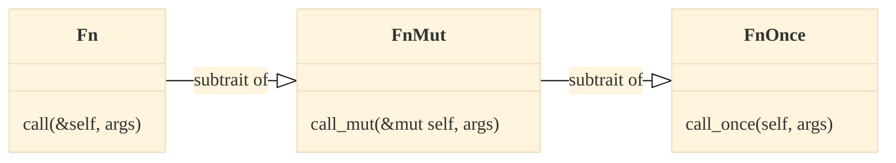

# Closures

---

## Closures

```rust
fn main() {
    let z = 42;
    let compute = move |x, y| x + y + z; // Whats the type of this?

    let res = compute(1, 2);
}
```

- Closures or lambda expressions are anonymous (unnamed) functions.

::: incremental

- They can capture ("close over") values in their scope.
- They are first-class values.
- They implement special traits: `Fn`, `FnMut` and `FnOnce`.

:::

::: notes

- The `compute` closure captures `z` and we need `move` in front to hand over
  the value `z` to the closure which becomes its owner. :::

:::

---

## What is a Closure?

The closure `|x: i32| x * x ` can _mechanistically_ be mapped to the following
`struct`

```rust {line-numbers="1"}
struct SquareFunc {}

impl SquareFunc {
  fn call(&self, x: i32) {
    x * x
  }
}
```

❗The "struct with fields" is a **mental model** how `|x: i32| x * x` is
_mechanistically_ implemented by the compiler.

---

## What is a `Fn` Closure?

For a closure which captures ("closes-over") variables from the environment:

```rust {line-numbers="2"}
let z = 43;
let square_it = |x| x * x + z;  // => Fn(i32) -> i32     (LSP)
                                // compiler opaque type: approx `SquareIt`.
square_it(10);
```

approx. maps to:

::::::{.columns}

:::{.column width="50%"}

```rust {line-numbers="2"}
struct SquareIt<'a> {
  z: &'a i32;
}

impl SquareIt {
  fn call(&self, x: i32) {
    x * x + self.z
  }
}
```

:::

:::{.column width="50%"}

```rust
let z = 43;
let square_it = SquareIt{z: &z};
square_it.call(10);
```

❗The closure by default **captures by reference**.

:::

::::::

---

## What is a `FnMut` Closure?

A closure with some **mutable state**:

::::::{.columns}

:::{.column width="60%"}

```rust {line-numbers="2,4,5"}
fn main() {
  let mut total: i32 = 0;

  let mut square_it = |x| {
      // => FnMut(i32) -> i32  (LSP)
      total += x * x;
      x * x
  };

  square_it(10);
  assert_eq!(100, total);
}
```

:::

:::{.column style="width:40%; align-content:center;"}

approx. maps to:

```rust {line-numbers="6"}
struct SquareIt<'a>' {
  total: &'a mut i32
}

impl SquareIt {
  fn call(&mut self, x: i32) {
    self.total += x * x;
    x * x
  }
}
```

:::

::::::

---

## Capture by Value

Capture by value with `move`:

::::::{.columns}

:::{.column width="60%"}

```rust {line-numbers="2,4" contenteditable="true"}
fn main() {
  let mut total: i32 = 0; // Why `mut` here?

  let mut square_it = move |x| {
      // => FnMut(i32) -> i32  (LSP)
      total += x * x;
      x + x
  };

  square_it(10);
  assert_eq!(0, total)
}
```

:::

:::{.column width="40%"}

approx. maps to:

```rust {line-numbers="2,6"}
struct SquareIt {
  total: i32
}

impl SquareIt {
  fn call(&mut self, x: i32) {
    self.total += x * x;
    x * x
  }
}
```

:::

::::::

::: notes

Without the `move` the snipped would not compile if you add `total += 1` on L9
as you cannot capture immutable into the closure and at the same time increment
`z`.

You need `mut` because you cannot `move` from a non `mut` value

:::

---

## Example - Quiz

Does it compile? Does it run without panic?

```rust {line-numbers= contenteditable="true"}
fn main() {
    let mut total: i32 = 0;

    let mut square_it = |x| { // => FnMut(i32) -> i32
        total += x * x;
        x * x
    };
    total = -1;

    square_it(10);
    assert_eq!(-1, total)
}
```

[**Answer:** It does not compile as `total` is mut. borrowed on L8.<br> Move
`square_it` before `total = -1`.]{.fragment}

---

## Closure Traits

`Fn`, `FnMut` and `FnOnce` are traits which implement **different behaviors** ff
for **closures**. _The compiler implements the appropriate ones!_



::::::{.columns}

:::{.column width="50%"}

::: incremental

::: {.p-no-margin}

- `Fn`: closures that can be
  - called multiple times **concurrently**
  - borrowed immutable.
- `FnMut`: closures that can be
  - called multiple times **not concurrently**
  - borrowed mutable.
- `FnOnce`: closures that can be
  - called once, it takes ownership of `self`.

:::

:::

:::

:::{.column width="50%" .fragment}

❗[All closure implement **at least** `FnOnce`.]{.emph}

:::

::::::

::: notes

- The `Fn` trait represents closures that can be called multiple times
  concurrently and can be borrowed immutably. This trait has one associated
  method, `call(&self, args)`, that takes a borrowed reference to self, and it
  can be implemented by any closure that meets these requirements.

- The `FnMut` trait represents closures that can be called multiple times and
  can be borrowed mutably. This trait has one associated method,
  `call_mut(&mut self, args)`, that takes a mutable reference to the self, and
  it can be implemented by any closure that meets these requirements.

- The `FnOnce` trait represents closures that can be called only once. This
  trait has one associated method, `call_once(self, args)`, that takes ownership
  of self, and it can be implemented by any closure that meets these
  requirements.

:::

---

## Quiz - What is it?

::::::{.columns}

:::{.column width="50%"}

```rust {contenteditable="true"}
let mut s = String::from("foo");
let t     = String::from("bar");

let func = || {
    s += &t;
    s
};
```

**Question:** Whats the type of `func`?

:::

:::{.column width="50%" .fragment}

**Answer:** Its only `FnOnce() -> String`, the compiler deduced that from the
function body and return type.

The _mental model_ is approx. this:

```rust
struct Closure<'a> {
    s : String,
    t : &'a String,
}

impl<'a> FnOnce<()> for Closure<'a> {
    type Output = String;
    fn call_once(self) -> String {
        self.s += &*self.t;
        self.s
    }
}
```

:::

::::::

---

## Closure and Functional Programming

Useful when working with iterators, `Option` and `Result`:

```rust
let numbers = vec![1, 3, 4, 10, 29];

let evens: Vec<_> = numbers.into_iter()
                           .filter(|x| x % 2 == 0)
                           .collect();
```

---

## Closures and Functional Programming (2)

Useful when generalizing interfaces, e.g. _visitor pattern_

```rust
struct Graph{ nodes: Vec<i32>; };

impl Graph {

  fn visit(&self, visitor: impl FnOnce(i32)) {
    // Remember: All closure at least implement `FnOnce`.
    for n in self.nodes {
      visitor(n) // Call visitor function for each node.
    }
  }

}
```
