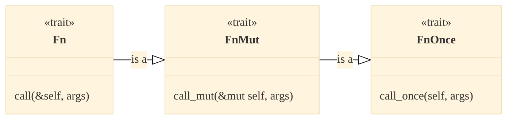

# Closures

---

## Closures

```rust
fn main() {
    let z = 42;
    let compute = move |x, y| x + y + z // Whats the type of this?

    let res = compute(1, 2)
}
```

- Closures or lambda expressions are anonymous (unnamed) functions.

::: incremental

- They can capture ("close over") values in their scope.
- They are first-class values.
- They implement special traits: `Fn`, `FnMut` and `FnOnce`.

:::

::: notes

- The `compute` closure captures `z` and we need `move` in front to hand over
  the value `z` to the closure which becomes its owner. :::

:::

---

## What is a Closure?

The compiler translates `|x: i64| x * x ` approx. into the following `struct`

```rust {line-numbers="1"}
struct SquareFunc {}

impl SquareFunc {
  fn call(&self, x: i64) {
    x * x
  }
}
```

---

## What is a `Fn` Closure?

For a closure with some state:

```rust
let z = 43;
let square_it = |x| x * x + z; // compiler opaque type: approx `SquareIt`.
```

approx. maps to:

```rust {line-numbers="2"}
struct SquareIt<'a> {
  z: &'a i64;
}

impl SquareIt {
  fn call(&self, x: i64) {
    x * x + self.z
  }
}
```

:::notes

The closure by default **captures by reference**.

:::

---

## What is a `FnMut` Closure?

A closure with some **mutable state**:

::::::{.columns}

:::{.column width="50%"}

```rust {line-numbers="2,4,5"}
fn main() {
  let mut total: i32 = 0;

  let mut square_it = |x| {
      total += x * x;
      x * x
  };

  square_it(10);
  assert_eq!(100, total);
}
```

:::

:::{.column style="width:50%; align-content:center;"}

approx. maps to:

```rust {line-numbers="6"}
struct SquareIt<'a>' {
  total: &'a mut i64
}

impl SquareIt {
  fn call(&mut self, x: i64) {
    self.total += x * x;
    x * x
  }
}
```

:::

::::::

---

## Capture by Value

Capture by value with `move`:

::::::{.columns}

:::{.column width="60%"}

```rust {line-numbers="2,4"}
fn main() {
  let mut total: i32 = 0; // Why `mut` here?

  let mut square_it = move |x| { // => FnMut(i32) -> i32
      total += x * x;
      x + x
  };

  square_it(10);
  assert_eq!(0, total)
}
```

:::

:::{.column width="40%"}

approx. maps to:

```rust {line-numbers="2,6"}
struct SquareIt {
  total: i64
}

impl SquareIt {
  fn call(&self, x: i64) {
    self.total += x * x;
    x * x
  }
}
```

:::

::::::

::: notes

Without the `move` the snipped would not compile as you cannot capture immutable
into the closure and at the same time increment `z`.

You need `mut` because you cannot `move` from a non `mut` value

:::

---

## Example - Quiz

Does it compile? Does it run without panic?

```rust {line-numbers=}
fn main() {
    let mut total: i32 = 0;

    let mut square_it = move |x| { // => FnMut(i32) -> i32
        total += x * x;
        total + x
    };
    total = 9;

    square_it(10);
    assert_eq!(9, total)
}
```

[**Answer:** It compiles and runs fine! `total` is not changed.]{.fragment}

---

## Closure Traits

`Fn`, `FnMut` and `FnOnce` are traits which implement **different behaviors**
for **closures**. _The compiler implements the appropriate ones!_



::: incremental

::: {.p-no-margin}

- `Fn`: closures that can be
  - called multiple times **concurrently**
  - borrowed immutable.
- `FnMut`: closures that can be
  - called multiple times **not concurrently**
  - borrowed mutable.
- `FnOnce`: closures that can be
  - called once, it takes ownership of `self`.

:::

:::

::: notes

- The `Fn` trait represents closures that can be called multiple times
  concurrently and can be borrowed immutably. This trait has one associated
  method, `call(&self, args)`, that takes a borrowed reference to self, and it
  can be implemented by any closure that meets these requirements.

- The `FnMut` trait represents closures that can be called multiple times and
  can be borrowed mutably. This trait has one associated method,
  `call_mut(&mut self, args)`, that takes a mutable reference to the self, and
  it can be implemented by any closure that meets these requirements.

- The `FnOnce` trait represents closures that can be called only once. This
  trait has one associated method, `call_once(self, args)`, that takes ownership
  of self, and it can be implemented by any closure that meets these
  requirements.

:::

---

## Closure and Functional Programming

Useful when working with iterators, `Option` and `Result`:

```rust
let numbers = vec![1, 3, 4, 10, 29];

let evens: Vec<_> = numbers.into_iter()
                           .filter(|x| x % 2 == 0)
                           .collect();
```
